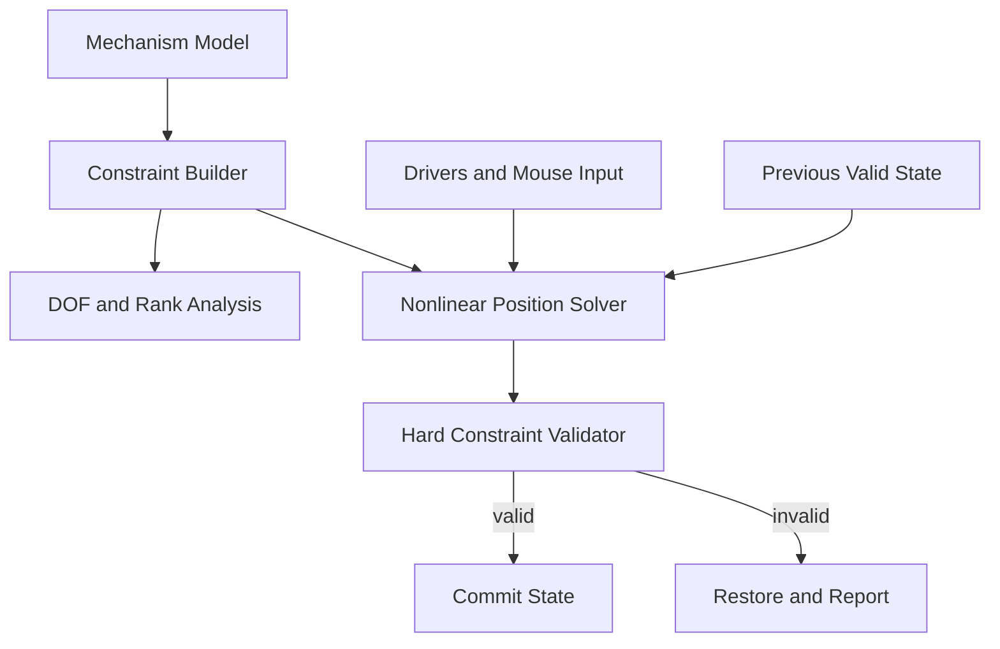

# General 2D Mechanism Solvers: Mathematics, Solvability, Algorithms, and Architecture

## 1. Purpose of this document

This document explains the general logic behind a two-dimensional mechanism solver. It is not documentation for one particular program. The goal is to explain how CAD and kinematic software can represent mechanisms, determine whether a mechanism is solvable, calculate positions and angles, detect impossible or ambiguous configurations, and continue motion smoothly.

The central idea is:

> A mechanism is a collection of unknown coordinates constrained by geometric equations.

The solver does not normally “know” the final coordinates directly. It builds equations from bars, joints, bearings, actuators, motors, and fixed supports, and then finds coordinates that satisfy all those equations.

---

## 2. Mechanism as a mathematical model

A mechanism contains three conceptually different things:

1. **Geometry** — nodes, rigid bodies, bars, and their dimensions.
2. **Constraints** — fixed joints, constant distances, coincident points, angle relations, sliders, and so on.
3. **Inputs** — commanded motor angles, actuator lengths, or mouse drag targets.

A convenient first representation is a graph:

- nodes of the graph are mechanical joints or rigid bodies;
- edges are bars, joints, actuators, or other relationships;
- some graph nodes or bodies are attached to ground.

The graph is useful for topology, but the graph alone does not calculate positions. Numerical coordinates and equations are also required.

---

## 3. Two common coordinate models

There are two important ways to represent a planar mechanism.

### 3.1 Point-coordinate model

Every joint has Cartesian coordinates:

$$
P_i=(x_i,y_i).
$$

For $N$ nodes, the complete unknown vector is

$$
q=
\begin{bmatrix}
x_1 & y_1 & x_2 & y_2 & \dots & x_N & y_N
\end{bmatrix}^{T}.
$$

This model is natural for bar-and-joint mechanisms. A rigid bar is represented by a constant distance between two points.

Advantages:

- simple equations;
- easy visual editing;
- easy creation of bars and sliders;
- well suited to trusses and linkage sketches.

Disadvantages:

- a general rigid body requires several point constraints;
- redundant coordinates may create redundant equations;
- body orientation is derived from points rather than stored directly.

### 3.2 Rigid-body pose model

Each rigid body has a planar pose:

$$
q_i=
\begin{bmatrix}
x_i & y_i & \theta_i
\end{bmatrix}^{T}.
$$

Here:

- $x_i,y_i$ are the body-origin coordinates;
- $\theta_i$ is the body orientation.

A point with local body coordinates

$$
p_{local}=
\begin{bmatrix}
u\\v
\end{bmatrix}
$$

has world coordinates

$$
p_{world}=
\begin{bmatrix}
x_i\\y_i
\end{bmatrix}
+R(\theta_i)p_{local},
$$

where the two-dimensional rotation matrix is

$$
R(\theta)=
\begin{bmatrix}
\cos\theta & -\sin\theta\\
\sin\theta & \cos\theta
\end{bmatrix}.
$$

Advantages:

- every body is automatically rigid;
- natural for CAD mates between bodies;
- orientation is an explicit variable;
- scalable to complicated bodies containing many joints.

Disadvantages:

- joint equations are more complicated;
- local-to-world transformations are required;
- the Jacobian is more involved.

Professional CAD systems usually use a rigid-body or hybrid representation. A simple linkage editor can use point coordinates successfully.

---

## 4. Fundamental geometric constraints

Every mechanical relationship contributes one or more scalar equations.

The complete system can be written as

$$
F(q,u)=0,
$$

where:

- $q$ contains unknown positions and orientations;
- $u$ contains prescribed inputs, such as motor angles and actuator lengths;
- $F$ is the vector of all constraint residuals.

A valid mechanism position is any $q$ for which every element of $F$ is zero within numerical tolerance.

### 4.1 Rigid bar

Let a bar connect points

$$
A=(A_x,A_y), \qquad B=(B_x,B_y)
$$

and have constant length $L$.

The distance equation is

$$
\sqrt{(B_x-A_x)^2+(B_y-A_y)^2}=L.
$$

An equivalent squared form is

$$
(B_x-A_x)^2+(B_y-A_y)^2-L^2=0.
$$

The squared form avoids a square root, although its numerical scaling must be handled carefully.

One rigid bar contributes **one scalar constraint**. It removes one relative degree of freedom between two point nodes, but it does not prevent their relative rotation about the connecting line.

### 4.2 Fixed point

If node $A$ is fixed at

$$
A^*=(A_x^*,A_y^*),
$$

then

$$
A_x-A_x^*=0,
$$

$$
A_y-A_y^*=0.
$$

A fixed planar point contributes two scalar constraints.

### 4.3 Coincident points

If points $A$ and $B$ must coincide,

$$
A_x-B_x=0,
$$

$$
A_y-B_y=0.
$$

This is the point-coordinate equivalent of a revolute pin connecting two body attachment points.

### 4.4 Absolute angle

For the vector from pivot $A$ to tip $B$, the angle can be measured using

$$
\theta=\operatorname{atan2}(B_y-A_y,B_x-A_x).
$$

`atan2` is preferred over ordinary arctangent because it knows the correct quadrant and works for vertical vectors.

Instead of constraining `atan2` directly, a robust motor equation often prescribes the vector components:

$$
B_x-A_x-L\cos\theta_{cmd}=0,
$$

$$
B_y-A_y-L\sin\theta_{cmd}=0.
$$

This simultaneously specifies the bar length and its world angle.

### 4.5 Relative angle between two links

Let

$$
v_1=A-P, \qquad v_2=B-P
$$

be two vectors meeting at pivot $P$.

Their signed relative angle can be computed by

$$
\theta_{rel}=\operatorname{atan2}
\left(
v_{1x}v_{2y}-v_{1y}v_{2x},
v_{1x}v_{2x}+v_{1y}v_{2y}
\right).
$$

The first argument is the two-dimensional cross product and the second is the dot product.

A relative-angle constraint is

$$
\operatorname{wrap}(\theta_{rel}-\theta_{cmd})=0.
$$

Angle wrapping maps the difference into a continuous interval such as

$$
(-\pi,\pi].
$$

Without wrapping, angles near $0^\circ$ and $360^\circ$ appear numerically far apart even though they represent nearly the same orientation.

### 4.6 Linear bearing or slider constraint

Let slider point $S$ move on the line through guide points $A$ and $B$.

Define

$$
g=B-A.
$$

The slider is on the infinite guide line when the two-dimensional cross product is zero:

$$
g_x(S_y-A_y)-g_y(S_x-A_x)=0.
$$

For better scaling, divide by guide length:

$$
\frac{g_x(S_y-A_y)-g_y(S_x-A_x)}{\|g\|}=0.
$$

This produces the signed perpendicular distance from the slider to the guide line.

The equation removes motion normal to the guide but permits motion along it. Therefore, an ideal linear bearing contributes one scalar constraint for a point node.

If motion must remain within a finite guide segment, introduce an inequality on the line parameter $t$:

$$
S=A+t(B-A),
$$

$$
t_{min}\le t\le t_{max}.
$$

### 4.7 Linear actuator

An actuator between points $A$ and $B$ has commanded length $s$:

$$
\|B-A\|-s=0.
$$

The actuator state may evolve as

$$
s_{k+1}=s_k+v_s\Delta t,
$$

with stroke limits

$$
s_{min}\le s\le s_{max}.
$$

At a stroke limit, the controller may stop, reverse, or report a limit event.

An actuator is a variable-length constraint. It must not also be represented by a fixed-length bar between the same endpoints, because the two equations would conflict whenever the actuator changes length.

---

## 5. Degrees of freedom

A degree of freedom is an independent coordinate that may change without violating the constraints.

### 5.1 Simple coordinate count

For $N$ independent point nodes in 2D, there are initially

$$
2N
$$

scalar coordinates.

If the system contains $m$ independent scalar constraints, the local mobility is approximately

$$
M=2N-m.
$$

This count is valid only when the constraints are independent. Redundant equations do not remove additional freedom.

### 5.2 Planar rigid-body mobility

A free planar rigid body has three degrees of freedom:

$$
x,\quad y,\quad \theta.
$$

For mechanisms with lower-pair joints, the Grübler–Kutzbach count is often written

$$
M=3(n-1)-2j_1-j_2,
$$

where:

- $n$ is the number of links including ground;
- $j_1$ is the number of one-DOF lower pairs, such as revolute and prismatic joints;
- $j_2$ is the number of higher-pair constraints.

This is a useful topological estimate, not a universal proof. Special geometry, redundant constraints, coincident joints, and singular configurations can change the actual instantaneous mobility.

### 5.3 Example: planar five-bar linkage

For a closed five-bar linkage with one grounded link and five revolute joints,

$$
n=5, \qquad j_1=5.
$$

Therefore,

$$
M=3(5-1)-2(5)=2.
$$

The mechanism needs two independent inputs for a unique commanded pose. If only one motor angle is given, one free motion remains.

---

## 6. The Jacobian and the real test of local solvability

Counting equations is not enough. The correct local tool is the constraint Jacobian:

$$
J(q)=\frac{\partial F}{\partial q}.
$$

The Jacobian describes how small coordinate changes affect constraint errors:

$$
F(q+\Delta q)\approx F(q)+J(q)\Delta q.
$$

If the Jacobian has rank $r$, then the local instantaneous mobility is

$$
M_{local}=n_q-r,
$$

where $n_q$ is the number of scalar unknown coordinates.

This rank-based result automatically accounts for redundant constraints.

### 6.1 Underconstrained system

If

$$
r<n_q,
$$

then the null space of $J$ is nonempty:

$$
J\Delta q=0
$$

has nonzero solutions.

Those null-space directions are instantaneous motions that preserve the constraints. The mechanism has free degrees of freedom and the position is not unique.

### 6.2 Locally fully constrained system

If the independent constraints remove all free motion,

$$
r=n_q,
$$

the configuration is locally isolated. Small changes cannot occur without changing an input or violating a constraint.

This does not guarantee that only one solution exists globally. There may be several disconnected assembly modes.

### 6.3 Redundant constraints

There may be more equations than unknowns while the system remains consistent. Some equations can repeat information already implied by others.

For example, fixing both endpoints of a ground bar already fixes its length. Adding the bar-length equation is redundant.

Redundancy appears as dependent Jacobian rows. It can improve validation but may worsen numerical conditioning.

### 6.4 Overconstrained inconsistent system

If the equations demand incompatible geometry, no exact solution exists:

$$
F(q)\ne0
$$

for every possible $q$.

Example:

- points $A$ and $B$ are fixed 100 mm apart;
- a rigid bar between them is commanded to have length 120 mm.

No coordinates can satisfy both requirements.

---

## 7. Four different meanings of “no solution”

It is important to distinguish several cases.

### 7.1 Geometrically unreachable

The requested input is physically outside the linkage workspace.

For two bars of lengths $L_1,L_2$ connecting fixed endpoints separated by distance $d$, an intersection exists only if

$$
|L_1-L_2|\le d\le L_1+L_2.
$$

Outside this interval, the circles do not intersect.

### 7.2 Overconstrained

Multiple constraints conflict. Each constraint may be valid individually, but not simultaneously.

### 7.3 Singular

A valid configuration exists, but the Jacobian loses rank. The system becomes locally ambiguous or extremely sensitive.

### 7.4 Numerical failure

A valid solution exists, but the algorithm does not find it because of a poor initial guess, wrong branch, bad scaling, large input step, insufficient iterations, or an unsuitable solver.

A good mechanism system should report these cases differently when possible.

---

## 8. Existence, uniqueness, and assembly modes

These are separate questions.

### 8.1 Existence

Does at least one configuration satisfy all constraints?

$$
\exists q:F(q,u)=0?
$$

### 8.2 Local uniqueness

Near the current configuration, is the solution isolated after inputs are applied? Jacobian rank and the implicit function theorem are used to answer this locally.

### 8.3 Global uniqueness

Are there other solutions far from the current configuration?

Many linkages have several valid assembly modes. For example, two-circle intersection produces an elbow-up and elbow-down position.

### 8.4 Continuity

Which solution should be selected as an input changes over time?

CAD systems usually prefer the branch connected continuously to the previous configuration.

---

## 9. Exact geometric solution versus general numerical solution

### 9.1 Exact geometric construction

Small mechanisms can often be solved using circle intersections, line intersections, and trigonometry.

Example:

- a known point and a rigid bar place the next joint on a circle;
- two known points and two bar lengths place the joint at a circle intersection.

Advantages:

- exact length preservation up to floating-point roundoff;
- fast;
- easy reachability tests;
- explicit alternative branches.

Disadvantages:

- requires a custom derivation for each topology;
- becomes complicated for arbitrary constraint networks;
- difficult to maintain as new joint types are added.

### 9.2 General nonlinear constraint solver

A general solver assembles all residuals into

$$
F(q,u)
$$

and solves

$$
F(q,u)=0.
$$

This works for arbitrary graphs and mixed constraint types, provided the equations and derivatives are defined.

Common methods include:

- Newton–Raphson;
- damped Newton;
- Gauss–Newton;
- Levenberg–Marquardt;
- trust-region least squares;
- sequential quadratic programming;
- constrained optimization;
- position-based iterative projection.

---

## 10. Newton and Gauss–Newton logic

At iteration $k$, linearize the constraints:

$$
F(q_k+\Delta q)\approx F(q_k)+J_k\Delta q.
$$

For a square, nonsingular system, Newton solves

$$
J_k\Delta q=-F(q_k)
$$

and updates

$$
q_{k+1}=q_k+\Delta q.
$$

For a non-square system, solve a least-squares problem:

$$
\Delta q=operatorname*{argmin}_{z}
\|J_kz+F(q_k)\|^2.
$$

The normal equations are

$$
J_k^TJ_k\Delta q=-J_k^TF(q_k),
$$

although QR or SVD factorizations are normally more stable than explicitly forming the normal equations.

A damped system is

$$
(J_k^TJ_k+\lambda I)\Delta q=-J_k^TF(q_k).
$$

The damping $\lambda$ improves behavior near singularities and with poor initial guesses.

---

## 11. How an underconstrained mechanism still moves in CAD

Suppose the hard constraints are

$$
F(q,u)=0
$$

but several valid $q$ values exist. The solver needs a secondary selection rule.

The most important rule is nearest-state continuation:

$$
q_{new}=
\operatorname*{argmin}_{q}
\|q-q_{previous}\|_W^2
$$

subject to

$$
F(q,u)=0.
$$

Here

$$
\|x\|_W^2=x^TWx
$$

is a weighted squared distance.

Meaning:

> Among all exact configurations, choose the one that changes least from the previous frame.

This is why an underconstrained mechanism can appear to move predictably even when the user supplies fewer inputs than its mobility count.

The software has not created a new physical constraint. It has added a numerical preference for continuity.

### 11.1 Mouse drag as a temporary objective

When the user drags point $P$ toward cursor position $P_c$, the solver may minimize

$$
\|P(q)-P_c\|^2
+\alpha\|q-q_{previous}\|^2
$$

subject to all hard mechanism constraints.

The cursor position should usually be a **soft target**, not a hard constraint. A mouse can be placed outside the node's reachable path. The mechanism should move to the nearest reachable point rather than stretch a bar.

---

## 12. Hard constraints and soft objectives

This distinction is essential.

### 12.1 Hard constraints

Must be satisfied within strict tolerance:

- rigid bar lengths;
- fixed supports;
- closed-loop joints;
- active motor commands;
- current actuator length;
- active bearing alignment.

### 12.2 Soft objectives

Express preferences:

- stay near the previous state;
- follow the mouse;
- prefer a reference posture;
- minimize total movement;
- avoid branch switching.

A least-squares implementation may use large weights for hard constraints and smaller weights for soft objectives, but it must independently validate hard errors afterward. Otherwise the solver may return a visually plausible compromise with stretched bars.

The safer mathematical form is constrained optimization:

$$
\min_q G(q)
$$

subject to

$$
F(q,u)=0.
$$

---

## 13. How motors define angles

A motor is not merely a visual rotation animation. It changes a constraint parameter.

### 13.1 Absolute motor

An absolute motor commands a link angle relative to the world x-axis:

$$
\theta(t)=\theta_0+\omega t.
$$

The motor equations place the driven point at

$$
B=A+L
\begin{bmatrix}
\cos\theta(t)\\
\sin\theta(t)
\end{bmatrix}.
$$

### 13.2 Relative motor

A relative motor commands the angle between two bodies or links:

$$
\theta_2-\theta_1=\theta_{cmd}(t).
$$

This is usually more physically correct for a motor mounted between two moving bodies.

### 13.3 Motor limits

With angular limits,

$$
\theta_{min}\le\theta\le\theta_{max}.
$$

At a limit, the driver may:

- stop;
- reverse direction;
- disable itself;
- generate an event;
- report an impossible command.

### 13.4 Continuous rotation and angle unwrapping

The orientations $0^\circ$ and $360^\circ$ are geometrically identical, but a motor may need to count revolutions. Maintain an unwrapped state such as

$$
0^\circ,360^\circ,720^\circ,\dots
$$

for driver logic, while using sine and cosine for geometric constraints.

---

## 14. How positions are calculated from angles

For one link attached to a known pivot, position follows directly from rotation:

$$
x=x_p+L\cos\theta,
$$

$$
y=y_p+L\sin\theta.
$$

For an open serial chain,

$$
x_k=x_0+\sum_{i=1}^{k}L_i\cos\Theta_i,
$$

$$
y_k=y_0+\sum_{i=1}^{k}L_i\sin\Theta_i,
$$

where $\Theta_i$ is the absolute orientation of link $i$.

If joint angles are relative,

$$
\Theta_i=\sum_{j=1}^{i}\theta_j.
$$

This is forward kinematics.

Closed chains are harder because the final chain must return to the closing joint. The closure equation is

$$
\sum_i L_i
\begin{bmatrix}
\cos\Theta_i\\
\sin\Theta_i
\end{bmatrix}=0.
$$

The unknown angles must satisfy both scalar components simultaneously.

---

## 15. Forward and inverse kinematics

### 15.1 Forward kinematics

Given independent joint inputs, calculate all body and joint positions.

For an open robot arm this is usually direct. For a closed linkage it may still require solving loop-closure equations.

### 15.2 Inverse kinematics

Given a desired point or body pose, calculate the required joint variables.

Inverse kinematics often has:

- no solution outside the workspace;
- one solution at a boundary or singularity;
- multiple solutions inside the workspace;
- infinitely many solutions for redundant mechanisms.

The same constraint-solver architecture can handle both forward and inverse problems by changing which variables are prescribed and which are unknown.

---

## 16. Singularities

A singularity occurs when the Jacobian loses rank.

### 16.1 Geometric example

Two connected bars become collinear. At the fully extended position,

$$
d=L_1+L_2.
$$

The two circle intersections merge. The elbow-up and elbow-down branches meet.

### 16.2 Consequences

Near a singularity:

- small input changes can cause large coordinate changes;
- velocity equations may require very large joint rates;
- branch switching becomes possible;
- Newton steps become unstable;
- the system may temporarily gain or lose instantaneous mobility.

### 16.3 Detection

Compute singular values of the Jacobian:

$$
J=U\Sigma V^T.
$$

If the smallest relevant singular value approaches zero, the system is near singular:

$$
\sigma_{min}\rightarrow0.
$$

The condition number

$$
\kappa=\frac{\sigma_{max}}{\sigma_{min}}
$$

becomes large.

---

## 17. Branches and configuration continuity

A nonlinear mechanism can have several disconnected solutions for the same input.

Examples include:

- elbow-up versus elbow-down;
- crossed versus open four-bar assembly;
- slider on one or the other side of a pivot;
- mirrored closed-chain configurations.

A branch identifier may be based on an orientation sign. For three points $A,B,C$, define

$$
s=\operatorname{sign}\left((B-A)\times(C-A)\right).
$$

The sign distinguishes which side of line $AB$ contains $C$.

Branch control methods include:

- nearest previous position;
- preserve orientation signs;
- limit maximum coordinate change;
- reduce simulation step near singularities;
- explicitly lock an assembly mode;
- use velocity prediction.

---

## 18. Time stepping and simulation

A pure kinematic simulator does not calculate forces or inertia. It advances driver variables and solves positions.

At time step $k$:

1. Save the last valid state $q_k$.
2. Advance input variables:

$$
   u_{k+1}=u_k+\dot u\Delta t.
$$

3. Predict an initial coordinate state.
4. Solve

$$
   F(q_{k+1},u_{k+1})=0.
$$

5. Validate every hard constraint.
6. Commit the new state only when valid.
7. Otherwise keep the last valid state and report an error.

### 18.1 Position prediction

The simplest initial guess is

$$
q_{guess}=q_k.
$$

A better predictor is

$$
q_{guess}=q_k+\dot q_k\Delta t.
$$

Prediction improves convergence and branch continuity.

### 18.2 Adaptive step size

If the solver fails, reduce $\Delta t$ and retry. If convergence is easy, increase it gradually. This helps near singularities and workspace boundaries.

---

## 19. Validation and the meaning of tolerance

Floating-point computation almost never gives exact mathematical zero. A constraint is accepted when

$$
|f_i(q)|\le\varepsilon_i.
$$

Tolerances should reflect units and model scale. A common form is

$$
\varepsilon=\varepsilon_{abs}+L_{scale}\varepsilon_{rel}.
$$

Validate different constraint types separately:

- maximum bar-length error;
- maximum fixed-point error;
- maximum motor vector error;
- maximum actuator-length error;
- maximum bearing-line distance;
- loop-closure error.

Never accept a solution merely because the optimizer reports success. Optimizer success means its stopping condition was met, not necessarily that the mechanism is physically valid.

---

## 20. Constraint scaling

Residuals may have different units:

- position errors in millimeters;
- angle errors in radians;
- squared-distance errors in square millimeters.

Poor scaling can cause the solver to satisfy one constraint while neglecting another.

Use normalized residuals such as

$$
\hat f_{distance}=\frac{\|B-A\|-L}{L_{scale}},
$$

$$
\hat f_{angle}=\frac{\operatorname{wrap}(\theta-\theta_{cmd})}{\theta_{scale}}.
$$

Scaling changes numerical conditioning, not physical priority. Hard-versus-soft status should be represented explicitly or with carefully separated weights and post-validation.

---

## 21. Suggested solver architecture



### 21.1 Model layer

Stores stable identities and parameters:

- bodies and nodes;
- local attachment coordinates;
- bars and joints;
- fixed supports;
- motors;
- actuators;
- bearings and limits;
- current and initial states.

The model should not depend on drawing objects.

### 21.2 Constraint layer

Every constraint type implements a common interface:

```text
residual(q, input) -> vector
jacobian(q, input) -> matrix rows
validate(q, tolerance) -> result
involved_variables() -> indices
```

Examples:

```text
DistanceConstraint
CoincidentConstraint
FixedPoseConstraint
AbsoluteAngleConstraint
RelativeAngleConstraint
PrismaticConstraint
ActuatorConstraint
DragObjective
```

### 21.3 Graph and component analysis

Before solving, split disconnected mechanism components. A disconnected floating component has free rigid-body motion unless grounded or temporarily controlled.

Use graph traversal to identify:

- connected components;
- grounded components;
- isolated nodes;
- closed loops;
- candidate redundant subgraphs.

### 21.4 Variable manager

Maps model IDs to positions in $q$:

```text
node 17 -> q[6], q[7]
body 4  -> q[12], q[13], q[14]
```

Stable model IDs should remain independent from temporary array indices.

### 21.5 Driver system

Drivers update command variables, not geometry directly:

```text
MotorDriver      -> commanded angle
ActuatorDriver   -> commanded length
MouseDriver      -> soft target position
TimelineDriver   -> keyframed values
ExpressionDriver -> formula-based value
```

### 21.6 Solver layer

Responsible for:

- assembling residuals and Jacobian;
- selecting initial guesses;
- choosing a nonlinear method;
- handling damping and step size;
- detecting rank loss;
- returning candidate coordinates and diagnostics.

### 21.7 Validation layer

Recomputes physical errors independently from optimizer residual weighting. It decides whether the candidate may be committed.

### 21.8 State and history layer

Stores:

- initial state;
- previous valid state;
- current candidate;
- motor and actuator states;
- branch indicators;
- undo and redo records.

The previous valid state is critical for continuation.

### 21.9 Presentation layer

Drawing and interaction should read the model but not become the source of truth. Screen coordinates must be transformed into world coordinates before creating constraints or mouse targets.

---

## 22. Recommended solve pipeline

```text
INPUT:
    model
    previous valid state
    driver commands
    optional mouse target

1. Build active variable vector q.
2. Build active hard constraints F(q,u).
3. Build soft objective G(q,q_previous,mouse).
4. Analyze connected components and obvious grounding errors.
5. Estimate Jacobian rank and local DOF.
6. Predict an initial q from the previous state.
7. Solve min G(q) subject to F(q,u)=0.
8. Recompute physical errors independently.
9. If all errors are within tolerance:
       commit q as the new valid state;
       update branch and velocity estimates.
   Otherwise:
       reject q;
       retain the previous valid state;
       classify and display the failure.
```

---

## 23. Pseudocode for a general continuation solver

```python
def solve_frame(model, previous_state, commands, mouse_target=None):
    q0 = predict(previous_state)

    hard_constraints = build_hard_constraints(model, commands)
    soft_objectives = [StayNear(previous_state.q)]

    if mouse_target is not None:
        soft_objectives.append(FollowMouse(mouse_target))

    diagnostics = analyze_rank(hard_constraints, q0)

    candidate = constrained_nonlinear_solve(
        initial=q0,
        constraints=hard_constraints,
        objective=soft_objectives,
    )

    errors = validate_all_constraints(model, commands, candidate.q)

    if errors.within_tolerance:
        return ValidState(candidate.q, diagnostics, errors)

    return InvalidState(
        q=previous_state.q,
        reason=classify_failure(candidate, errors, diagnostics),
    )
```

---

## 24. Diagnosing solvability in practice

For each connected component, report:

| Condition | Meaning | Typical behavior |
|---|---|---|
| Positive DOF | Underconstrained | Use drag or nearest-state continuation |
| Zero DOF, full rank | Locally determined | Inputs define an isolated pose |
| Dependent rows | Redundant constraints | Warn; solve with rank-aware method |
| Nonzero hard residual | Inconsistent or unreachable | Reject candidate |
| Very small singular value | Near singular | Reduce step, damp solver, warn |
| Multiple distant solutions | Multiple assembly modes | Preserve current branch or let user choose |
| Floating component | No ground reference | Preserve previous pose or add ground constraint |

---

## 25. Important limitations of DOF formulas

Mobility formulas count topology, but actual geometry matters.

Examples:

- three nominally different constraints can become identical when points coincide;
- parallel or collinear bars can cause rank loss;
- a mechanism can be rigid in general but mobile in one special pose;
- redundant loops can create internal stress in a physical structure even if geometric equations are consistent;
- inequalities and contacts change the active constraint set during motion.

Therefore, use both:

1. symbolic or topological DOF estimates;
2. numerical Jacobian rank at the current configuration.

---

## 26. Kinematics versus dynamics

A kinematic solver answers:

- where are the bodies?
- what angles satisfy the geometry?
- is the commanded pose reachable?

It does not answer:

- what forces act at joints?
- what torque does the motor require?
- how does mass and inertia affect motion?
- what happens after impact?

A dynamic solver introduces velocities, accelerations, masses, forces, and constraint reactions. A common differential-algebraic form is

$$
M(q)\ddot q+C_q(q)^T\lambda=Q,
$$

with constraints

$$
C(q,t)=0.
$$

For an editor intended first for mechanism geometry, a position-level kinematic solver is the correct starting point.

---

## 27. Practical design rules

1. Store geometry separately from rendering.
2. Give every model object a stable ID.
3. Treat each relationship as a constraint object.
4. Separate hard constraints from soft user intentions.
5. Always start a new solve from the previous valid pose.
6. Never commit a candidate without independent physical validation.
7. Detect Jacobian rank and condition, not only equation count.
8. Preserve assembly branches until a deliberate transition is requested.
9. Use `atan2`, angle wrapping, and unwrapped motor state correctly.
10. An actuator replaces a fixed-length relationship; it must not conflict with it.
11. A slider removes perpendicular motion but keeps translation along its guide.
12. Mouse dragging should project onto the reachable manifold.
13. Reduce time steps near workspace limits and singularities.
14. Report underconstrained, inconsistent, singular, and numerical failure as different states.
15. Build small analytic solvers where topology is known, but retain a general nonlinear solver for arbitrary networks.

---

## 28. Final mental model

The most useful way to think about mechanism software is:

```text
Coordinates q describe a possible world.
Constraints F(q,u)=0 describe the allowed worlds.
Inputs u move or reshape the allowed set.
The solver finds one allowed world.
The previous state and mouse objective decide which one to choose.
The Jacobian explains local freedom, redundancy, and singularity.
Validation decides whether the candidate is physically acceptable.
```

When there is no solution, the requested inputs and constraints have no common geometric configuration. When there are many solutions, continuation and user interaction select one. When there is one local solution, the independent inputs determine the pose. When the Jacobian loses rank, the mechanism is singular and ordinary assumptions about uniqueness or smooth motion may fail.

That logic is the foundation of a general two-dimensional mechanism and mate solver.
